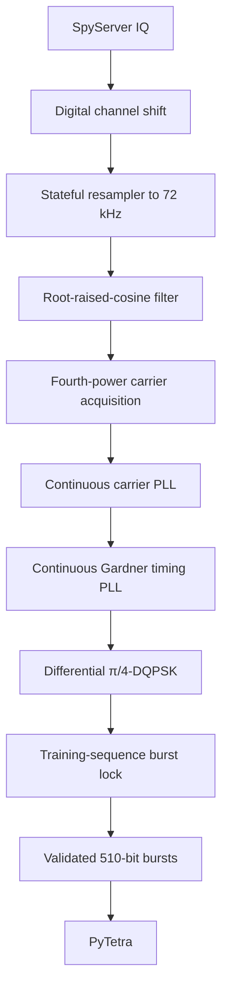

# PyTetra-live

PyTetra-live is a minimal SpyServer IQ client, stateful TETRA π/4-DQPSK
demodulator, and live input bridge for PyTetra. It implements only the client
protocol needed to receive IQ. It does not implement or replace SpyServer.

Every live output line uses the same local timestamped logging format,
including compact PyTetra summaries and full `--debug` layer diagnostics.

The protocol-decoder project remains separate:

- PyTetra-live: SpyServer IQ → validated 510-bit downlink bursts
- PyTetra: bursts → MAC → LLC → MLE → CMCE/MM/SNDCP

## Status

Version 1.0.0 is an initial live implementation. Its network protocol and
offline burst-framing paths are covered by automated tests. A real SpyServer
session is still required to validate RF-specific carrier/timing loop settings
for each receiver and signal environment.

The decoder never inserts replacement symbols or fabricates missing bits. When
burst lock is lost, incomplete data is discarded and PyTetra protocol state is
reset before delivery resumes at a newly validated burst.

Weak-signal reception uses a selective 25 kHz channel filter, slow RMS level
normalization, coherence-gated carrier tracking, and three-burst structural lock
confirmation. A rejected burst is still discarded rather than reconstructed.

## Requirements

- Python 3.9 or newer
- NumPy
- SciPy
- an official SpyServer reachable over TCP
- PyTetra Downlink 1.0.0 when live protocol decoding is desired

## Installation

Keep both repositories next to each other:

```text
projects/
├── pytetra/
└── pytetra-live/
```

Installation is optional. From the `pytetra-live` directory, run directly
against a sibling PyTetra checkout with:

```bash
PYTHONPATH=.:../pytetra python3 -m pytetra_live.cli \
  --host HOST --port PORT --frequency FREQUENCY_HZ
```

For example, replace `HOST`, `PORT`, and `FREQUENCY_HZ` with the SpyServer
address, SpyServer port, and desired TETRA downlink frequency in hertz.

Create a virtual environment and install both projects:

```bash
cd projects
python3 -m venv .venv
source .venv/bin/activate
python3 -m pip install -e ./pytetra
python3 -m pip install -e ./pytetra-live
```

PyTetra-live can run without PyTetra by adding `--no-decode`. This is useful
when only IQ or `.bits` recording is required.

## Required arguments

The following options are always required:

| Option | Meaning |
|---|---|
| `--host` | SpyServer hostname or IP address |
| `--port` | SpyServer TCP port |
| `--frequency` | TETRA downlink channel frequency in Hz |

Example for the supplied server scenario:

```bash
pytetra-live \
    --host 127.0.0.1 \
    --port 5556 \
    --frequency 392475000
```

## Server settings and precedence

If `--gain` is omitted, the gain reported by SpyServer is retained.

If `--center-frequency` is omitted, PyTetra-live asks SpyServer to digitally
center this client's IQ stream on `--frequency`. This per-client operation does
not move the shared hardware center and remains available when device control
is locked, provided the frequency lies inside the IQ range reported by
SpyServer. The narrowest suitable stream is then selected; a 6 MS/s server
normally supplies 93.75 kS/s for a single TETRA channel.

If the requested frequency lies outside the permitted per-client IQ range,
PyTetra-live retains the existing IQ center and falls back to the narrowest
wider stream that can be shifted locally. It fails only when no supported
stream contains the requested channel.

After digital channel selection, carrier acquisition automatically estimates
and corrects a residual tuner or oscillator error of up to approximately
2.25 kHz around the requested frequency. The carrier PLL continues tracking
small changes during reception. This bounded search cannot silently select an
adjacent 25 kHz TETRA channel.

Burst lock uses short-fade hysteresis. A structurally invalid burst is dropped
and reported as a downstream gap without synthesizing any replacement bits.
Carrier, timing, and quadrant mapping remain locked unless twenty-four consecutive
bursts are invalid. Sustained damage triggers full burst reacquisition.

During direct live delivery, π/4-DQPSK symbol distances are retained as signed
bit confidence. A soft-decision Viterbi decoder uses that confidence after
unscrambling and deinterleaving. Corrected control blocks are delivered only
when their normal TETRA CRC succeeds; failed blocks remain discarded. The
compatible `.bits` output intentionally remains hard-decision data.

PyTetra decoding runs in a separate ordered worker queue so convolutional and
protocol decoding cannot stall IQ reception. Every 30 seconds the normal log
reports the DSP real-time factor, IQ depth, queued decoder batches and bursts,
decoder overruns, discarded bursts, and the time
share of the resampler, filter, carrier, timing, and framing stages.

Bursts produced by one DSP block are transferred to the decoder as one ordered
batch. Decoded Layer-2 and Layer-3 records use the `PYTETRA` log label;
SpyServer, DSP, performance, signal-quality, and lifecycle messages retain the
normal `INFO` label.

Use `--log` to save the normal output in the current directory. Use
`--log DIRECTORY` to select another directory. The file is named after the
first decoded cell, for example `2026-09-01 MCC204 MNC1000 LA2333.log`.
`--logdebug [DIRECTORY]` records the complete debug stream instead and adds
` debug` to the filename. The two file options are mutually exclusive.
Long-running logs automatically rotate to a new dated file at local midnight.

Software amplitude gain is unnecessary: carrier estimation, timing recovery,
and differential decisions already normalize amplitude. Multiplying samples
would amplify noise by the same factor and cannot improve SNR. RF gain remains
the useful control for weak signals.

Every 30 seconds, a `Signal quality` line reports the pre-normalization input
level in dBFS, an adjacent-band SNR estimate, carrier coherence and residual
frequency, RMS phase and timing errors, recovered samples per symbol, timing
drift in ppm, interval burst-success percentage, average interval
training-sequence errors, and current lock state. These are relative receiver
diagnostics rather than calibrated dBm measurements. Compare readings with the
same receiver gain and SpyServer IQ format. The SNR estimate can be distorted
when another transmission occupies either adjacent noise-reference band.

Explicit center and gain:

```bash
pytetra-live \
    --host 192.168.1.20 \
    --port 5556 \
    --frequency 392475000 \
    --center-frequency 392500000 \
    --gain 18
```

If SpyServer reports that device control is locked, requested device settings
are not forced. The current server values are retained and logged.

## Recording

Write validated unpacked bursts while decoding live:

```bash
pytetra-live \
    --host 127.0.0.1 \
    --port 5556 \
    --frequency 392475000 \
    --bits-output live.bits
```

Write normalized IQ as interleaved little-endian float32 values:

```bash
pytetra-live \
    --host 127.0.0.1 \
    --port 5556 \
    --frequency 392475000 \
    --iq-output live.cf32 \
    --no-decode
```

The IQ file layout is:

```text
I0 Q0 I1 Q1 ...
```

## Useful options

| Option | Behavior |
|---|---|
| `--center-frequency HZ` | Request an explicit IQ center |
| `--gain INDEX` | Request a device gain index |
| `--sample-rate HZ` | Request at least this IQ sample rate |
| `--bits-output PATH` | Append validated unpacked bursts |
| `--iq-output PATH` | Append normalized float32 IQ |
| `--no-decode` | Do not import or feed PyTetra |
| `--debug` | Show DSP state and complete PyTetra diagnostics |
| `--show-esi` | Include mode-2/3 ESI records in compact decoded output |
| `--show-security-context` | Log MCC/MNC/LA/CCK context changes at INFO level |
| `--log [DIRECTORY]` | Save normal output using an automatic cell filename |
| `--logdebug [DIRECTORY]` | Save complete debug output using a cell filename |
| `--no-reconnect` | Stop on network failure |
| `--reconnect-delay SEC` | Delay between connection attempts |
| `--duration SEC` | Stop after a bounded test run |

## SpyServer protocol subset

Implemented client operations:

- HELLO handshake using protocol 2.0.1700
- device-info and client-sync parsing
- IQ-only streaming mode
- IQ format, frequency, decimation, optional gain, start, and stop settings
- UINT8, INT16, and FLOAT IQ decoding
- fragmented TCP read reconstruction
- message-size limits and stream sequence-gap detection
- reconnect with DSP and PyTetra state reset

Not implemented:

- SpyServer service functionality
- FFT/waterfall streams
- audio streams
- SpyServer directory registration
- multi-client management
- INT24 IQ

## DSP pipeline



Initial carrier acquisition uses a bounded two-second buffer. Carrier and
symbol timing are then tracked continuously rather than searching the entire
recording repeatedly.

## Tests

```bash
python3 -m unittest discover -s tests -v
```

The tests include a simulated TCP SpyServer, fragmented protocol messages,
setting verification, IQ-format conversion, stateful resampling, CLI argument
validation, and all 200 bursts from the synthetic PyTetra example.

## Responsible use

Use this software only where radio reception and analysis are lawful and
authorized. Do not expose an unrestricted SpyServer control port to the public
internet.
